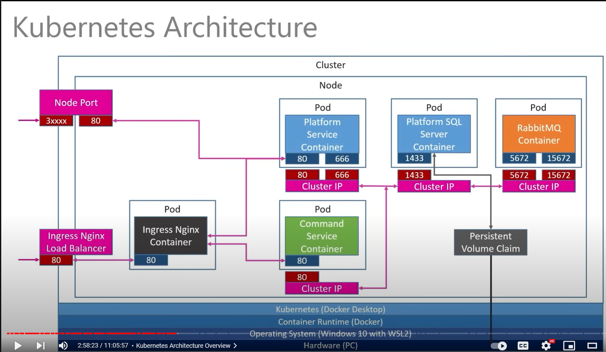

DELETE all

kubectl delete deployment --all
kubectl delete service --all
kubectl delete pod --all
kubectl delete configmap --all
kubectl delete secret --all
kubectl delete ingress --all
kubectl delete pvc --all
kubectl delete pv --all
kubectl delete namespace --all

Reapply

kubectl apply -f platforms-depl.yaml
kubectl apply -f platforms-np-srv.yaml

Check

kubectl get pods 
kubectl get services 

Port forwarding seems working
kubectl port-forward pod/platforms-depl-7fcc4f65bf-gvmm8 8080:8080
Then access via http://localhost:8080/api/platforms

